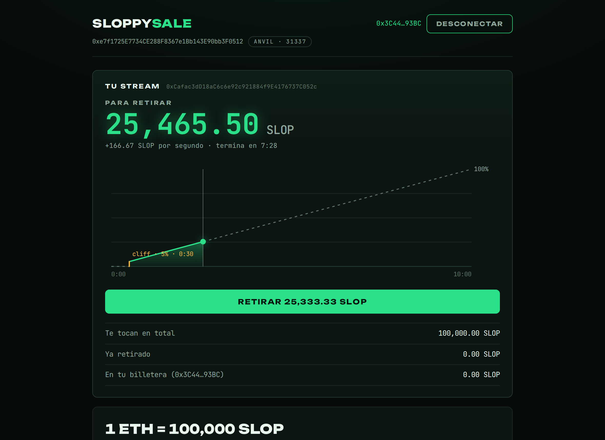
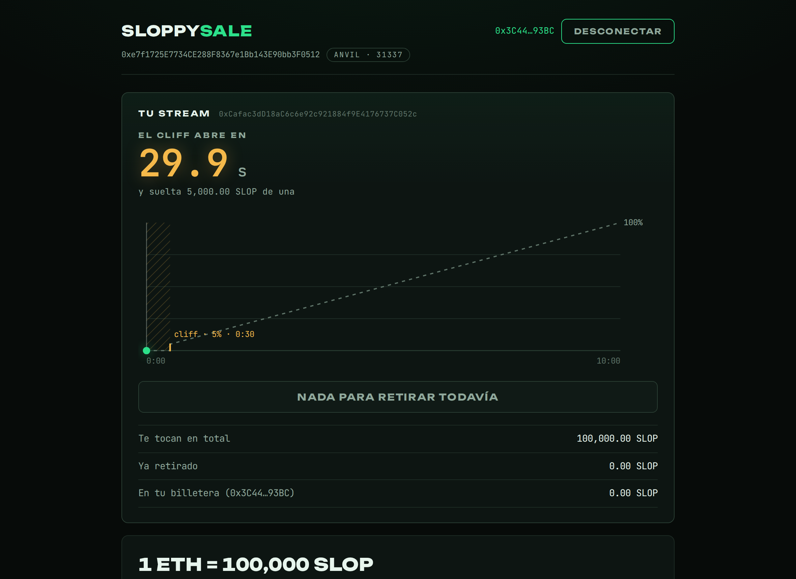

# SloppySale

Una venta de tokens que streamea: mandás ETH, recibís 100,000 tokens
por cada uno y tu stream arranca **en ese mismo instante**. Nada por 30
segundos, después caen 5,000 de golpe, y de ahí **~166.67 por segundo**
hasta completar los 10 minutos. Retirás lo liberado cuando quieras. El
dev se queda con el ETH y no tiene ninguna forma de tocar los tokens
que ya vendió.

Este repo acompaña al artículo **Solidity para Humanos**.



## El demo en dos comandos

```bash
export PRIVATE_KEY=0x...   # la cuenta con ETH de Hoodi que despliega

make deploy-hoodi     # despliega token + venta en la testnet Hoodi
make web              # levanta el frontend contra eso
```

El primero deja el token desplegado, la venta fondeada con 10,000,000
SLOP y las direcciones escritas en `web/public/deployments.json`. El
segundo abre [localhost:5173](http://localhost:5173) apuntando ahí. El
frontend saca la red de ese mismo archivo, así que no hay que
configurarle nada. Comprás desde MetaMask y a los 30 segundos empieza
el show.

La `PRIVATE_KEY` también se puede dejar en un `.env` (mirá
`.env.example`; el `.env` no se sube al repo). `make balance` te dice
con qué cuenta vas a firmar y cuánto ETH tiene.

> Eso es para testnet. Para algo con valor real usá el keystore cifrado
> —`make account`, que es lo que `make deploy-hoodi` toma si no hay
> `PRIVATE_KEY`— o una hardware wallet. Una llave en texto plano queda
> en el disco y en el historial de tu shell.

Para probarlo sin gastar nada, es lo mismo pero contra un nodo local:

```bash
anvil                 # terminal 1
make deploy-local     # terminal 2
make web
```

> **Por qué Hoodi y no Holesky:** Holesky se apagó en septiembre de 2025
> y Sepolia se retira en septiembre de 2026. Hoodi tiene soporte hasta
> 2028. Cambiar de red es una línea en `src/chain/config.ts`.

En Hoodi, las direcciones de la página son links a
[Blockscout](https://eth-hoodi.blockscout.com): retirás y vas a ver tus
SLOP en el explorador. En anvil no hay explorador y los links se
esconden solos.

## Los dos contratos

Están los dos en [`src/SloppySale.sol`](src/SloppySale.sol).

**`SloppyVesting`** es la pieza genérica, y es exactamente el contrato
del artículo. Existe nada más porque `VestingWalletCliff` de
OpenZeppelin es `abstract`: no se puede hacer
`new VestingWalletCliff(...)`, alguien tiene que escribir la subclase
concreta que cablea los dos constructores. Eso son estas líneas, sin
una sola de lógica:

```solidity
contract SloppyVesting is VestingWalletCliff {
    constructor(
        address beneficiary,
        uint64 startTimestamp,
        uint64 durationSeconds,
        uint64 cliffSeconds
    )
        VestingWallet(beneficiary, startTimestamp, durationSeconds)
        VestingWalletCliff(cliffSeconds)
    {}
}
```

**`SloppySale`** es el producto cerrado alrededor de esa pieza. Vende a
precio fijo y en cada compra despliega un `SloppyVesting` a nombre del
comprador, con el reloj arrancando en ese bloque:

```solidity
function buy() external payable {
    if (msg.value == 0) revert NoEth();
    if (address(vestingOf[msg.sender]) != address(0)) {
        revert AlreadyBought(address(vestingOf[msg.sender]));
    }

    uint256 tokens = msg.value * TOKENS_PER_ETH;
    uint256 available = unsold();
    if (tokens > available) revert InsufficientInventory(tokens, available);

    SloppyVesting vesting =
        new SloppyVesting(msg.sender, uint64(block.timestamp), DURATION, CLIFF);
    ...
}
```

Todo lo que define la venta está en MAYÚSCULAS porque no lo puede
cambiar nadie, ni el dev. `TOKENS_PER_ETH`, `DURATION` y `CLIFF` son
**constantes**: 100,000 por ETH, 10 minutos, 30 segundos, horneadas en
el bytecode e iguales en cualquier despliegue. `TOKEN` es lo único que
se elige al desplegar, y por eso es lo único que hay que revisar antes
de firmar.

Reusar `VestingWallet` en vez de escribir la aritmética cuesta
**~676,668 de gas por compra**: cada compra despliega el contrato del
stream. Es el precio de no mantener esa fórmula.

## Una compra por dirección

Es la regla menos obvia del contrato y viene directo de un
comportamiento documentado de OpenZeppelin:

> *Any assets transferred to this contract will follow the vesting
> schedule as if they were locked from the beginning.*

`VestingWallet` no registra cuándo llegó cada token: mira el balance y
le aplica la fracción de tiempo transcurrido a todo. Si se pudiera
comprar dos veces, la segunda compra caería en un reloj ya avanzado y
una parte quedaría liberada al instante — comprás 1 wei al abrir, volvés
al minuto 9 con la compra grande, y te llevás el 90% de una. Por eso
`buy()` revierte con `AlreadyBought` si tu dirección ya tiene stream.

## Las reglas

| | |
|---|---|
| Precio | 1 ETH = 100,000 SLOP |
| Stream | 10 minutos desde tu compra |
| Cliff | 30 segundos: cae el 5% de golpe |
| Ritmo | ~166.67 SLOP por segundo por cada ETH |
| Venta | Abierta mientras haya inventario |
| Compras | Una por dirección |

Con 1 ETH:

| Momento | Puede retirar | % |
|---|---:|---:|
| La compra (arranca el reloj) | 0.00 | 0.00% |
| 1 segundo antes del cliff | 0.00 | 0.00% |
| Cliff (segundo 30) | 5,000.00 | 5.00% |
| Minuto 1 | 10,000.00 | 10.00% |
| Minuto 5 | 50,000.00 | 50.00% |
| Minuto 10 (fin) | 100,000.00 | 100.00% |

La tabla sale del propio contrato: `make schedule`.



## Lo que el dev puede y no puede hacer

Puede retirar el ETH recaudado, cuando quiera.

No puede tocar los tokens. No existe la función. Lo que se vendió está
en el contrato de vesting de cada comprador, que es dueño de su propio
stream. El dev tampoco puede cambiar el precio, el calendario ni
cancelar una compra: todo eso es constante o inmutable.

## El frontend: dónde mirar y dónde no

```
web/src/chain/        <- el tronco. lo unico que sabe de wagmi y viem
web/src/components/   <- las hojas. solo UI
```

**`src/chain/`** es la única carpeta que importa wagmi o viem. Expone
tres hooks de dominio y nada más:

```ts
const wallet = useWallet();               // conectar, desconectar, red
const {sale, buy, withdrawEth} = useSale();
const {stream, claim} = useMyStream(sale);
```

Los componentes reciben `bigint` y `string`, no saben que existe una
cadena. Si algo va a mover fondos o a leer mal un saldo, el error está
en esa carpeta: ahí es donde hay que mirar con calma.

Y no es una convención escrita en un comentario, la hace cumplir el
linter:

```
src/components/Row.tsx:1:1: error eslint(no-restricted-imports):
  'wagmi' import is restricted. Components do not talk to the chain.
  All wagmi/viem lives in src/chain and is used through its hooks.
```

Stack: Vite + React + wagmi + viem. Las lecturas van por HTTP directo
al nodo, así que la página muestra la venta aunque no haya ninguna
billetera conectada; la billetera hace falta para comprar y retirar. Si
tu billetera está en otra red, la página te lo dice y te ofrece el
switch en un click.

### El contador que corre solo

Si el número solo cambiara cuando llega un bloque, se movería a saltos
cada 12 segundos y en anvil no se movería nunca. Así que la capa lleva
un reloj propio: se **ancla al timestamp del último bloque** y le suma
el tiempo real transcurrido desde que lo leyó.

```ts
// src/chain/schedule.ts
const elapsedMs = Date.now() - anchor.local;
const nowMs = Number(anchor.chain) * 1000 + elapsedMs;
```

Con eso el contador corre **diez veces por segundo** sin alejarse nunca
de lo que ve el contrato, porque cada bloque nuevo vuelve a anclarlo. A
~166.67 SLOP por segundo, los decimales giran como surtidor de
gasolina. La fórmula del vesting está replicada en TypeScript **solo
para mostrar**: lo que se retira de verdad lo calcula el contrato en el
bloque donde entra la transacción. Con `prefers-reduced-motion` el tick
baja a una vez por segundo.

Si preferís que los bloques lleguen empujados en vez de preguntados,
apuntá el frontend a un RPC websocket:

```bash
VITE_RPC_URL=wss://0xrpc.io/hoodi make web
```

No hace el contador más suave —eso lo hace el reloj anclado—, pero
re-ancla en el instante en que llega cada bloque.

### La gráfica

El calendario completo dibujado: la promesa punteada, el muro ámbar del
cliff, y el área verde que se llena detrás de una aguja que avanza en
vivo. Antes del cliff, la zona rayada y un countdown; cuando cae, el
área aparece de golpe — el escalón del contrato, hecho geometría. Es un
SVG puro en [`StreamChart.tsx`](web/src/components/StreamChart.tsx),
sin ninguna librería de charts: recibe números y dibuja.

## El end to end

Navegador real, frontend real, wagmi firmando contra los contratos.

```bash
make e2e
```

```
✓ la venta muestra el precio y el inventario
✓ comprar 1 ETH arranca el stream en ese mismo instante
✓ la cotizacion sigue lo que escribis
✓ no se puede comprar dos veces con la misma cuenta
✓ antes del cliff no se puede retirar y el countdown corre
✓ en el cliff caen 5,000 de golpe y se pueden retirar
✓ el numero sube solo mientras miras la pagina
✓ la aguja de la grafica avanza en vivo
✓ al final del stream se retira todo
✓ dos retiros: en el cliff y a la mitad
✓ el dev retira el ETH y no ve ninguna forma de sacar tokens
✓ un comprador no ve el panel del dev
✓ cada comprador ve solo lo suyo

13 passed
```

Playwright levanta anvil y el dev server solo, y los reusa si ya están
arriba. Cada test estrena su propia venta.

Dos piezas hacen que esto sea posible:

**Viajar en el tiempo.** Un stream de 10 minutos tampoco se espera: el
test mueve el reloj de la cadena con `evm_setNextBlockTimestamp` y fija
el timestamp del bloque justo antes de cada transacción, así las cifras
son siempre las mismas. En una red real el bloque cae unos segundos
después y sale un poquito más.

**Una billetera inyectada.** En vez de automatizar una extensión, el
test inyecta un proveedor EIP-1193 que reenvía todo al RPC de anvil,
que tiene esas cuentas desbloqueadas. Arranca sin autorizar, así que el
test tiene que apretar "Conectar" de verdad. El frontend no sabe que
está en una prueba: ve `window.ethereum` como con cualquier billetera.

## Comandos

```bash
make help          # lista todo
make balance       # con que cuenta vas a firmar y cuanto ETH tiene
make deploy-hoodi  # despliega el demo en la testnet
make deploy-local  # lo mismo en anvil
make web           # levanta el frontend
make test          # contratos: unitarias + fuzz + invariantes
make e2e           # navegador real contra el frontend y anvil
make test-all      # las dos cosas
make schedule      # imprime la tabla del stream
make gas           # reporte de gas
make lint          # forge lint + oxlint
```

> **Un footgun de Foundry que vale la pena conocer:** si editás un
> contrato y después corrés `forge lint`, forge deja el artefacto sin
> bytecode *y* marca la caché como fresca. El `forge build` siguiente
> dice "no files changed" y no lo arregla, así que el despliegue falla
> con `No contract bytecode`. Por eso los targets del Makefile que
> necesitan bytecode compilan con `--force`.

## Qué se probó

**23 pruebas unitarias y de fuzzing** con los números concretos del
producto: 1 ETH arranca un stream de 100,000 tokens en el acto, el
cliff suelta 5,000 de golpe, cada segundo libera ~166.67, una segunda
compra revierte, el dev retira el ETH y un extraño no.

**6 invariantes** que se verifican contra secuencias aleatorias de
"alguien compra", "pasa el tiempo", "alguien retira" y "el dev retira
el ETH":

1. Sin vender + vendido es siempre el inventario original.
2. Cada token vendido está en el stream de su comprador o en su
   billetera. En ningún otro lado.
3. El ETH solo puede estar en la venta o en manos del dev.
4. Antes de su propio cliff, ningún comprador tiene ni un token.
5. El dev nunca tiene tokens.
6. El stream de cada comprador es suyo y su reloj arrancó en su compra.

**13 pruebas end to end** que recorren el producto completo desde el
navegador, incluidas una que verifica que el contador sube solo y otra
que la aguja de la gráfica avanza mientras la página está abierta.

## El tronco: checklist antes de desplegar en serio

Esto es lo que hay que revisar con calma. El resto es hoja.

- [ ] **El token**: ¿es la dirección correcta? ¿Es ERC-20 estándar de 18
      decimales? Este contrato no sirve para fee-on-transfer ni rebase.
      Es lo único que se elige al desplegar.
- [ ] **Los números horneados**: 100,000 por ETH, 10 minutos, 30
      segundos. Son constantes de demo. Para una venta real, editá esas
      tres líneas del contrato, corré `make test-ci` y redesplegá.
- [ ] **El inventario**: transferí solo lo que estés dispuesto a vender.
      Lo que sobre queda encerrado ahí para siempre.
- [ ] **El dueño**: es quien despliega. Que sea un multisig o una llave
      de verdad respaldada, porque es el único que puede sacar el ETH.
- [ ] **Versión de OpenZeppelin**: fijada en el submódulo (`v5.6.1`) y
      en `foundry.lock`. Si cambia, hay que volver a leer el diff.
- [ ] **Versión de solc y `evm_version`**: fijadas en `foundry.toml`.
- [ ] **`src/chain/`**: las direcciones y la red que consume el
      frontend son parte del tronco, no del maquillaje. Si apunta al
      contrato equivocado, el usuario firma cualquier cosa.
- [ ] **Las llaves privadas nunca en el ambiente donde corre el
      agente.** Otra máquina u otra partición, con `cast wallet import`
      o hardware wallet.

## Comportamientos heredados que hay que conocer

Vienen de `VestingWallet` de OpenZeppelin y este contrato los adopta.

- **El comprador es dueño de su stream y puede transferir ese
  ownership.** Puede vender su posición completa, incluyendo lo que
  todavía no se liberó.
- **No hay revocación.** Ni clawback, ni pausa, ni admin.
- **El retiro es permissionless.** Cualquiera puede dispararlo y pagar
  el gas; los tokens siempre van al comprador.
- **Todo token que llega tarde cuenta como si estuviera desde el
  inicio.** Es la razón de la regla de una compra por dirección.
- **Tokens con comisión o rebase rompen la contabilidad.**

## Estructura

```
src/SloppySale.sol               los dos contratos
test/SloppySale.t.sol            unitarias y fuzzing
test/SloppySale.invariant.t.sol  invariantes
script/DeployDemo.s.sol          el despliegue de un comando
web/src/chain/                   todo wagmi + viem vive aca
web/src/components/              UI, sin una linea de web3
web/local/                       cuentas y despliegue para el e2e
web/e2e/                         pruebas end to end
SPEC.md                          el spec que vino antes del codigo
```

## Licencia

MIT.
